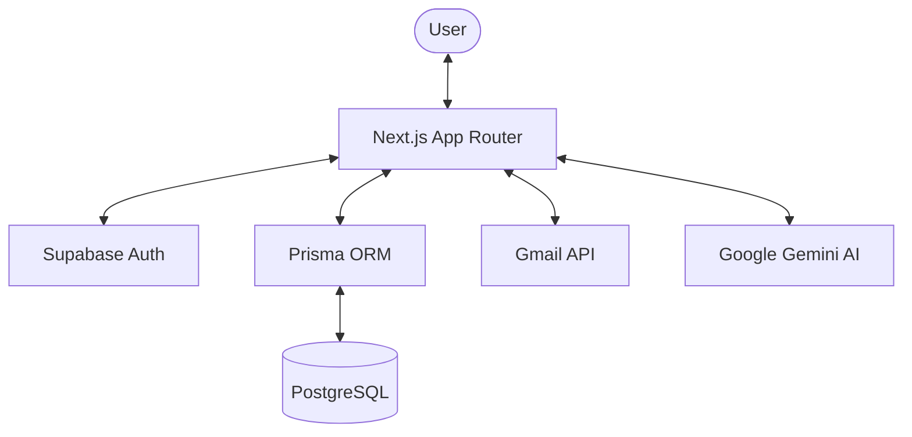

# System Architecture

## Overview

The AI Email Management System is a full-stack Next.js application that integrates with external services (Gmail, Google AI) to provide an enhanced email experience.

## Component Diagram

## Core Modules

### 1. Data Layer (`lib/prisma.ts`)
Uses Prisma to manage email storage, user preferences, and AI-generated metadata (summaries, translations).

### 2. AI Services (`lib/ai-services.ts`)
Wraps Google Gemini API for:
- Summarization
- Sentiment Analysis
- Translation (Tamil focus)

### 3. Email Processing (`lib/gmail-client.ts`)
Handles OAuth2 token exchange and fetching messages/attachments from Gmail.

### 4. Classification Engine
- **Spam Detector (`lib/spam-detector.ts`)**: Uses Bayes classification and heuristics.
- **Priority Classifier (`lib/priority-classifier.ts`)**: Ranks emails based on sender reputation and content urgency.

## Security Flow

1. **Authentication**: Supabase handles user sessions via HTTP-only cookies.
2. **Access Control**: Middleware verifies session validity before allowing API access.
3. **Encryption**: sensitive tokens (like Google Refresh Tokens) are encrypted using AES-256-GCM before database storage.
4. **Content Safety**: Frontend uses `DOMPurify` to render email HTML safely.

## Data Schema

- **User**: Profile and preference settings.
- **Email**: Metadata, content, and classification flags.
- **Job**: Tracks background synchronization tasks.
